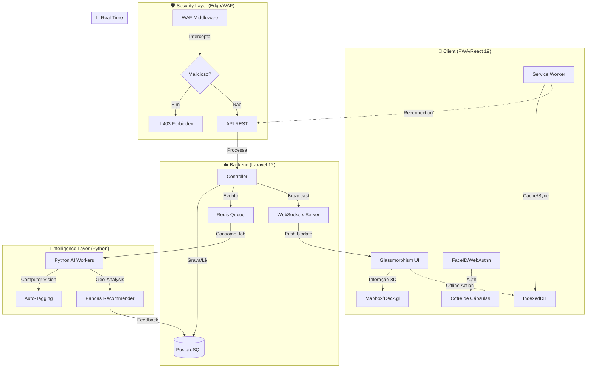

# 🏛️ Aurora Maps - Arquitetura Unificada (The Blueprint)

> **Visão do CTO:** *"Uma plataforma viva, onde o mapa é o protagonista e a tecnologia é invisível."*

Este documento detalha a arquitetura técnica para integrar as 6 camadas fundamentais do Aurora Maps (Visual, Game, AI, Offline, Security, Real-Time) em um sistema coeso, performático e seguro.

---

## 1. Fluxo de Dados (The Data Flow)

Este diagrama representa como os dados trafegam desde o toque do usuário no vidro (Frontend) até o processamento profundo (IA) e o feedback em tempo real.



---

## 2. O "Hero Flow": A Jornada da Cápsula

**Cenário:** Usuário encontra uma cápsula rara em uma área sem internet.

1.  **Imersão & Gamificação (Offline):**
    *   O usuário caminha pela cidade. O **React** (via Service Worker) carregou o mapa 3D do cache.
    *   Detecta via **Geofencing Local** (cálculo no device) que está a <10m de uma "Digital Drop".
    *   A cápsula aparece flutuando em AR (Realidade Aumentada) sobre a câmera.

2.  **Segurança (Biometria):**
    *   Para abrir, o app solicita **FaceID**. A WebAuthn API valida a biometria localmente. O cofre abre.

3.  **Interação (Queueing):**
    *   O usuário coleta o item e tira uma selfie de vitória.
    *   Como está **Offline**, a ação e a foto são salvas no **IndexedDB** e enfileiradas pelo Workbox Background Sync.

4.  **Sincronização & IA (Background):**
    *   A internet volta. O Service Worker detecta e dispara o `POST /api/capsules/collect`.
    *   O **WAF** valida a requisição (tokens, integridade).
    *   O Laravel recebe a foto e dispara um **Job** (`ProcessImageTags`).
    *   O **Python Engine** acorda, baixa a foto, roda Computer Vision (detecta "Sorriso", "Parque", "Dia") e salva as tags no PostgreSQL.

5.  **Social Real-Time (Feedback):**
    *   O Laravel dispara um evento `CapsuleCollected`.
    *   O **WebSocket** avisa todos os amigos do usuário: *"Pamela acabou de encontrar uma Cápsula Rara no Ibirapuera!"*.
    *   Uma notificação push chega para eles.

---

## 3. Estrutura de Pastas Monorepo Definitiva

Organização para manter o caos sob controle, separando responsabilidades mas mantendo a união do projeto.

```plaintext
AuroraMaps/
├── 📂 backend/                 # O Cérebro Lógico (Laravel)
│   ├── app/
│   │   ├── Security/          # 🛡️ WAF Interno & Guards
│   │   ├── Services/Game/     # 🎮 Lógica de Gamification (Drops, XP)
│   │   └── Events/            # 📡 Eventos Real-time
│   ├── database/              # Migrations & Seeds
│   └── routes/api.php
│
├── 📂 frontend/                # A Face (React + Vite)
│   ├── src/
│   │   ├── components/3d/     # 🏙️ Elementos 3D/Mapas
│   │   ├── offline/           # 🔌 Service Workers & Sync Logic
│   │   ├── security/          # 🔐 Biometria & Auth Consumers
│   │   └── styles/            # 🎨 Glassmorphism Theme
│   └── public/service-worker.js
│
├── 📂 ai-engine/               # A Inteligência (Python)
│   ├── detectors/             # 👁️ Computer Vision Scripts
│   ├── recommenders/          # 🗺️ Geo-Pandas Algorithms
│   ├── workers/               # 👷 Filas de processamento
│   └── aurora_analytics.py    # (Já criado)
│
├── 📂 docker/                  # A Infraestrutura
│   ├── redis/                 # Filas & Cache
│   ├── websockets/            # Laravel Reverb / Soketi
│   └── nginx/                 # Reverse Proxy (WAF Edge)
│
└── 📄 docker-compose.yml       # Orquestração de tudo
```

---

## 4. Notas Técnicas de Performance

*   **Filas (Jobs):** NUNCA processar imagens ou IA na requisição HTTP (síncrona). Sempre despachar para o Redis. O usuário recebe um "Ok, processando..." instantâneo.
*   **Lazy Loading 3D:** Carregar modelos 3D pesados apenas quando o usuário der zoom na área.
*   **Optimistic UI:** No Frontend, mostrar "Cápsula Coletada" imediatamente, mesmo antes do servidor confirmar. Se der erro depois, reverter suavemente.

Este blueprint garante que o **Aurora Maps** seja seguro, inteligente e, acima de tudo, uma experiência mágica para o usuário.
