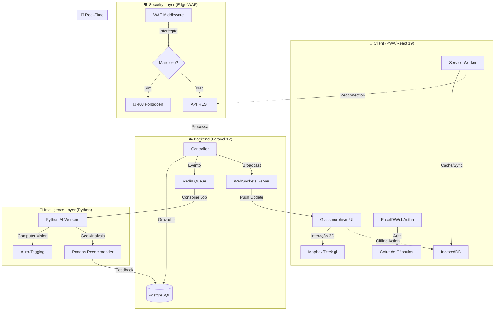

# 🌌 Aurora Maps (Monorepo)

> "Mapas não são apenas coordenadas; são experiências esperando para serem descobertas." — Pamela M.S., Dev Full Stack Junior.

Bem-vindo ao **Aurora Maps**. Este projeto é minha tentativa de criar uma experiência de geolocalização que não seja apenas funcional, mas visualmente deslumbrante e tecnicamente robusta.

Estamos construindo um ecossistema onde exploradores urbanos e amantes da natureza podem criar, compartilhar e descobrir "Pulse" (nossa rede social de lugares) em tempo real.


---

## 🏛️ Arquitetura (The Blueprint)

> **Visão da Dev Full Stack Junior:** *"Uma plataforma viva, onde o mapa é o protagonista e a tecnologia é invisível."*

Muitos projetos de mapas falham porque são apenas... mapas. Nós arquitetamos o Aurora Maps pensando em **Domain-Driven Design (DDD)** desde o dia 1. Não queremos models e controllers espalhados sem sentido. Queremos que o código conte uma história.

### Fluxo de Dados (The Data Flow)

Este diagrama representa como os dados trafegam desde o toque do usuário no vidro (Frontend) até o processamento profundo (IA) e o feedback em tempo real.



### O Stack (Escolhas Pragmáticas)

- **Backend (Laravel 12)**: Escolhi Laravel pela elegância e velocidade de desenvolvimento. Usamos uma arquitetura de Serviços para manter os Controllers magros.
- **Frontend (React 19 + Vite)**: React 19 para aproveitar as novas features de concorrência. A estrutura é focada em **Features**, não em tipos de arquivo.
- **AI Engine (Python/FastAPI)**: O cérebro por trás das recomendações. Isolado em Python para usar o melhor de Data Science.

---

## 🧠 Aurora AI (The Special Sauce)

Eu não queria que o projeto fosse apenas um CRUD. Por isso, criei um microsserviço dedicado de Inteligência Artificial (`/ai-engine`).

### Para que serve?
1.  **Recomendações Geográficas**: Analisa os pontos favoritos do usuário e sugere novos locais com "vibes" similares (ex: Parques, Cafés).
2.  **Computer Vision (Futuro)**: Preparado para analisar fotos das Cápsulas e taguear automaticamente (ex: "Natureza", "Urbano").

### O Stack de Data Science
Usei **Python** porque é a língua nativa da AI:
-   **FastAPI**: Para servir os modelos com performance assíncrona absurda.
-   **Pandas 🐼**: Usado para "crunching" de dados geoespaciais.
    -   *Exemplo:* O Pandas carrega o DataFrame de POIs (Points of Interest), calcula distâncias usando a fórmula de Haversine vetorizada e filtra outliers muito mais rápido que o SQL faria em loops complexos.
-   **Scikit-Learn**: Para clusterização de locais (K-Means) em atualizações futuras.

---

## 🚀 Como Rodar (Sem Dor de Cabeça)

Eu odeio configurar ambientes locais complexos, então containerizei tudo.

### Pré-requisitos
- Docker & Docker Compose (Se não tiver, instale. É vida).
- Um café forte ☕.

### 1. Levante os Containers
Na raiz do projeto:

```bash
docker compose up -d
```
*Dica: Use `--build` se for a primeira vez ou se eu tiver adicionado alguma dependência maluca.*

### 2. Setup Inicial do Backend
Só precisa fazer isso uma vez (prometo):

```bash
# Instalar dependências do PHP
docker compose exec app composer install

# Gerar a chave do app
docker compose exec app php artisan key:generate

# Rodar as migrações (Cria as tabelas no DB)
docker compose exec app php artisan migrate
```

### 3. Acessando
- **Frontend**: [http://localhost:5173](http://localhost:5173) (A mágica acontece aqui)
- **Backend API**: [http://localhost:8080/api](http://localhost:8080/api) (O motor)

---

## 📂 Estrutura de Pastas (Para Humanos)

Organizei o código de forma que você encontre o que precisa sem precisar de um GPS. Cohesion > Coupling.

```plaintext
AuroraMaps/
├── 📂 backend/                 # O Cérebro Lógico (Laravel)
│   ├── app/
│   │   ├── Security/          # 🛡️ WAF Interno & Guards
│   │   ├── Services/Game/     # 🎮 Lógica de Gamification (Drops, XP)
│   │   └── Events/            # 📡 Eventos Real-time
│   ├── database/              # Migrations & Seeds
│   └── routes/api.php
│
├── 📂 frontend/                # A Face (React + Vite)
│   ├── src/features/          # ❤️ Onde o app vive (maps, auth, pulse)
│   ├── src/components/        # 🎨 UI genérica e reutilizável
│   └── public/service-worker.js
│
├── 📂 ai-engine/               # A Inteligência (Python)
│   ├── detectors/             # 👁️ Computer Vision Scripts
│   ├── recommenders/          # 🗺️ Geo-Pandas Algorithms
│   └── workers/               # 👷 Filas de processamento
│
└── 📄 docker-compose.yml       # Orquestração de tudo
```

---

## 📔 Diário de Desenvolvimento (Dev Notes)

*Mantido por: Pamela M.S. (Dev Full Stack Junior)*

Rastreamos aqui as decisões de arquitetura e o *porquê* das coisas mudarem.

### [2025-12-29] O Rebranding "Pulse"
Decidimos utilizar o nome **Pulse** em vez de "Geo-Feed".
**Motivo:** "Geo-Feed" soava muito simples. "Pulse" remete à batida da cidade em tempo real. Refatoramos todas as rotas e UI components.

### [2025-12-28] Login Crash & A Caça ao `<Text>`
Tivemos um `Uncaught NotFoundError` crítico ao logar.
**Resolução:** Adicionei um `ErrorBoundary` global no `App.jsx`. Para garantir que o app não quebre inteiramente se um erro ocorrer.

### [2025-12-25] Estratégia de Fallback de Geolocalização
Implementei o `LocationService` no backend com redundância.
1. Tentamos **Overpass (OSM)** primeiro (Grátis).
2. Se falhar, caímos para **Geoapify** (Pago/Freemium).
*Custo operacional otimizado.*

### [2025-12-20] React Router vs Next.js
Optei por **Vite + React Router** (SPA) em vez de Next.js.
**Por quê?** O Aurora Maps é altamente interativo com WebGL e estado persistente no cliente. O SSR traria complexidade desnecessária para nosso caso de uso "App-like".

---

## 🤝 Contribuindo

Se você viu um bug ou tem uma ideia genial:

1. **Abra um PR**.
2. **Não commite código quebrado**. Eu rodo os testes.
3. **Mantenha o padrão**. Se usarmos `Service`, use `Service`. Consistência é chave.

---

> "Código é poesia escrita para máquinas lerem e humanos manterem."
